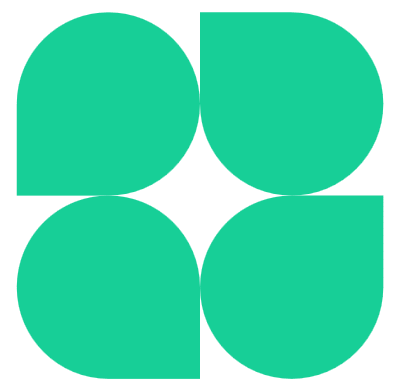
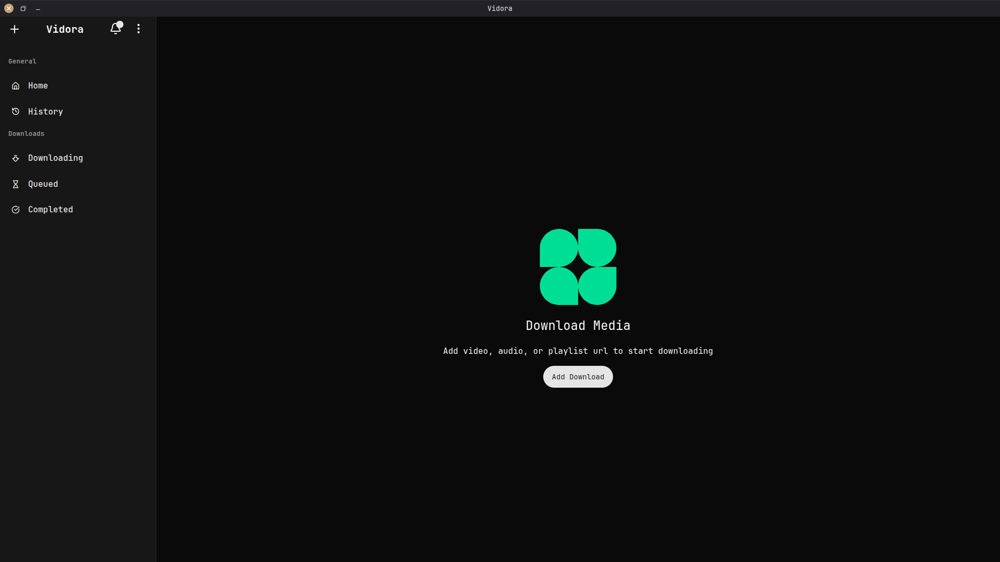
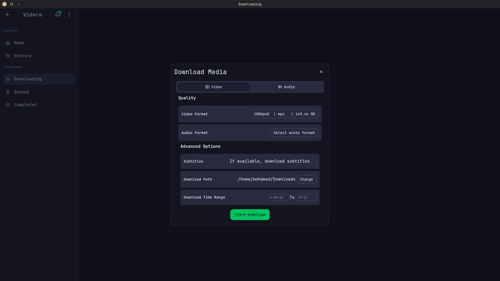
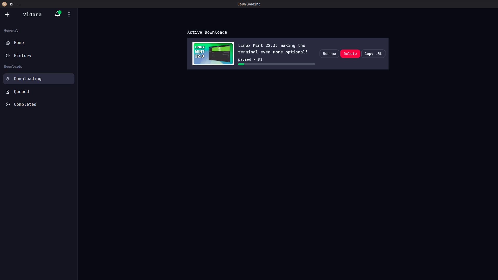
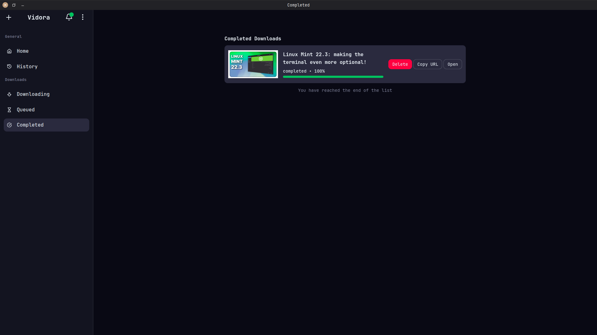
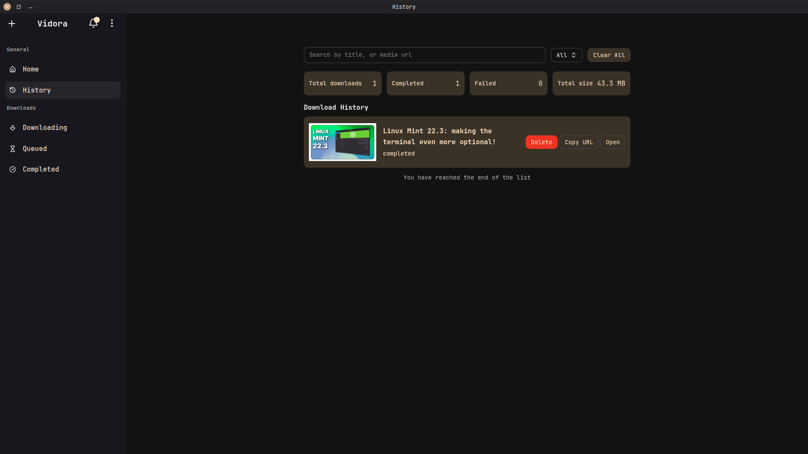

<p align="center">
  <!-- Replace with your actual logo path once published -->
  
</p>

<h1 align="center">Vidora – Modern Video & Audio Downloader</h1>

<p align="center">
  Cross‑platform desktop app for downloading videos & audio using yt‑dlp and ffmpeg, with a clean UI and background updates.
</p>

---

## Screenshots

Below is a collage of screenshots that walks through a typical user journey.

| Step                                     | Screenshot                                                                               |
| ---------------------------------------- | ---------------------------------------------------------------------------------------- |
| **1. Home / Downloads view**             |                                    |
| **2. Start a new download (URL + info)** |  |
| **3. Download in progress**              |                             |
| **4. Completed downloads**               |                       |
| **5. History page**                      |                                     |
| **6. Preferences / settings**            |                      |

---

## Features

- [x] Cross‑platform: Windows, macOS, Linux
- [x] Download videos and audio via **yt‑dlp**
- [x] Uses **ffmpeg** for muxing / conversion
- [x] Modern Electron UI with custom toolbar
- [x] Paste‑to‑download flow (detect URL from clipboard)
- [x] Download queue with status tracking
- [x] History of completed downloads
- [x] Background **app update** notifications
- [x] Background **yt‑dlp** update notifications
- [x] Notification center built on **IndexedDB**
- [ ] **Playlist mode** (planned)

---

## Tech stack

- **Runtime:** Electron
- **Language:** TypeScript
- **Bundler / tooling:** Vite, electron‑vite
- **Renderer:** Web Components + custom UI library
- **Storage:** IndexedDB + localStorage (for notifications and some UI state)
- **Electron Store** (for download jobs and history)
- **Electron Updater** (for app updates)

### Key dependencies

- [`electron`](https://www.electronjs.org/)
- [`yt-dlp`](https://github.com/yt-dlp/yt-dlp) (external binary)
- [`ffmpeg`](https://ffmpeg.org/) (external binary)
- [`electron-vite`](https://electron-vite.org/)
- [`pnpm`](https://pnpm.io/) for package management

---

## Install (prebuilt app)

For **end users**, the easiest way to use Vidora is to download a prebuilt binary from the **Releases** page.

1. Go to the repository **Releases** page.
2. Download the installer / package for your OS:
   - **Windows**: `.exe` or `.msi`
   - **macOS**: `.dmg` or `.zip`
   - **Linux**: `.AppImage`, `.deb`, `.rpm`, etc.

3. Install and run the app as you would any other desktop application.

> Platform‑specific packaging details may evolve; always follow the notes on the latest Release.

---

## Running the app locally (for development)

To work on Vidora locally, you’ll run the Electron app from source. This is intended for contributors and advanced users.

### 1. Prerequisites

- **Node.js** (LTS recommended)
  - Download from: https://nodejs.org/
- **pnpm** package manager
  - Install via: `npm install -g pnpm`
- **ffmpeg** binary installed and available on your system
  - Download ffmpeg from [here](https://github.com/yt-dlp/FFmpeg-Builds/releases) if you are on windows or linux
  - Download ffmpeg from [here](http://www.osxexperts.net/) if you are on macos

> **Important:** ffmpeg is required if you want to **test the app locally** from source. Without a working ffmpeg installation, startup checks will fail.

### 2. Clone and install dependencies

```bash
git clone https://github.com/mohamed7-dev/vidora.git
cd vidora
pnpm install
```

### 3. Start the app in development mode

```bash
pnpm dev
```

This will start the Electron + renderer dev servers with hot reloading.

### 4. Build distributables

```bash
# For Windows
pnpm build:win

# For macOS
pnpm build:mac

# For Linux
pnpm build:linux
```
